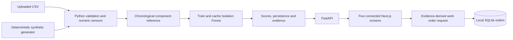

# RailGuard implementation and operations

RailGuard is a local predictive-maintenance demonstration with five connected screens: Fleet Overview, Train Analysis, Component Twin, AI Explanation and Maintenance Advisory. A selected dataset, train and component refer to the same Python-generated findings throughout the application.

## Run the application

From the repository root in Windows PowerShell or PowerShell 7:

```powershell
.\scripts\setup.ps1
.\scripts\start.ps1
```

Open [RailGuard](http://127.0.0.1:3000). When dependencies are already installed, only the start command is needed. The API is available at [its interactive documentation](http://127.0.0.1:8000/docs), and [the health endpoint](http://127.0.0.1:8000/api/health) should return `status: "ok"`.

For a demo or presentation, check and build the frontend once with development stopped, then serve the built application:

```powershell
.\scripts\stop.ps1
.\scripts\check.ps1
.\scripts\start.ps1 -Production
```

`-Production` selects `next start` and requires `frontend/.next/BUILD_ID`. It starts the same local Python API and uses the same URL. Rebuild after frontend changes. Without the switch, the launcher keeps its normal `next dev` behavior.

Setup requires Node.js 20.9 or newer and Python 3.12 or newer. The tested environment uses Windows, Python 3.12.14 and Node.js 24.15.0. Python dependencies are captured in `requirements-lock.txt`; `requirements.txt` records the intended dependency ranges. Frontend versions are locked by `frontend/package-lock.json`.

`setup.ps1` uses an existing `.venv`, or creates one using the Windows `py` launcher and then `python` as a fallback. Select a particular interpreter when creating an environment:

```powershell
.\scripts\setup.ps1 -Python 'C:\Path\To\Python\python.exe'
```

Setup installs the tested Python lock by default and runs `npm ci`. The optional `-RefreshDependencies` switch installs the Python version ranges instead; run the checks after refreshing. Stop the application before changing its dependencies.

If Windows blocks a script under the current execution policy, a process-scoped invocation is sufficient; the scripts do not change the machine policy:

```powershell
powershell -NoProfile -ExecutionPolicy Bypass -File .\scripts\start.ps1
```

Use `pwsh` in place of `powershell` if PowerShell 7 is your preferred shell. The same form works for setup, check and stop.

## Start, stop and inspect logs

The launcher starts these commands in hidden background processes:

```text
.venv\Scripts\python.exe -m uvicorn backend.api:app --host 127.0.0.1 --port 8000
node frontend\node_modules\next\dist\bin\next dev --hostname 127.0.0.1 --port 3000
```

The Python working directory is the repository root; the Next.js working directory is `frontend`. Both services bind to loopback. `start.ps1` checks dependencies, refuses occupied ports and waits for both HTTP endpoints. It records the service PIDs, executable paths and process start times in `.logs/processes.json`.

```powershell
.\scripts\start.ps1 -ValidateOnly   # Validate paths without starting processes
.\scripts\start.ps1 -Production -ValidateOnly  # Also require an existing production build
.\scripts\stop.ps1                 # Stop only matching recorded services and their children
Get-Content .\.logs\backend.err.log -Tail 60
Get-Content .\.logs\frontend.err.log -Tail 60
```

Standard output is stored in the corresponding `backend.out.log` and `frontend.out.log` files. `-NoWait` starts the services and returns before readiness checks. The scripts set `NEXT_TELEMETRY_DISABLED=1` for their process environment, avoiding Next.js telemetry configuration writes outside the project. The stop script checks identity and start time so a reused PID is not treated as the previous RailGuard service. It terminates verified process objects, waits for exit, and retains the launch record if termination fails. It does not stop a server started manually or an unrelated listener. If a port is occupied, identify its existing owner instead of killing processes by port number.

The launcher uses the Next.js development server by default; `-Production` serves a previously built frontend for local presentation. Neither mode configures remote deployment, a Windows service or an externally reachable server. Next's CLI provides separate development, build and production-start commands, along with explicit host/port flags. [Official Next.js CLI reference](https://nextjs.org/docs/app/api-reference/cli/next).

## Architecture and the frontend exception

The saved brief prefers Streamlit for a simple solo build. The current request calls for an interactive Three.js component view and the existing React-style glass interface. Next.js/React/Three.js is therefore retained for that concrete presentation requirement. Python remains responsible for CSV parsing, preprocessing, model training, scoring, evaluation and explanations. The tradeoff is two local processes and a small HTTP contract instead of one Streamlit process.



| Location | Responsibility |
| --- | --- |
| `backend/synthetic.py` | Reproducible labelled demonstration scenarios and provenance metadata |
| `backend/detector.py` | Input validation, reference preprocessing, real model fit, cache, scoring and evidence |
| `backend/api.py` | Dashboard/detail/upload/export and work-order HTTP routes |
| `backend/orders.py` | Atomic local work-order persistence and transitions |
| `frontend/` | Shared selection, charts, component rendering and advisory interactions |
| `data/` | Generated example CSVs, units and injection metadata |
| `tests/` | Data, detector, API and regression checks |

The frontend proxies `/api/*` to `http://127.0.0.1:8000` by default. `RAILGUARD_API_URL` can override that destination in the Next.js environment for a deliberate alternate local setup. The field-level contract is in [API_CONTRACT.md](API_CONTRACT.md). FastAPI supplies OpenAPI-backed interactive API documentation. [Official FastAPI documentation](https://fastapi.tiangolo.com/).

The dashboard displays a dataset snapshot. There is no connected live railway sensor feed. Component geometry is an explanatory visualization rather than a surveyed or mechanically calibrated engineering twin.

## Data and automatic training

CSV uploads are limited to 20 MiB and are parsed with real CSV quoting support. All accepted rows are processed; there is no silent 400-row preview cap. A timestamp and usable numeric sensor evidence are required. Known identifiers, equipment indices, labels, fault markers and scenario columns are excluded from detector inputs. Speed and ambient temperature can be contextual inputs when physical sensors are present.

Numeric sensor discovery retains columns with finite numeric evidence, including partially corrupt sensor columns. Warnings identify ambiguous columns for review. Duplicate headers and excess-field rows are rejected. Omitted trailing fields remain missing with a warning. Rows with invalid timestamps are excluded with a count; no observation times are synthesized. Dates without an explicit timezone are interpreted as UTC with a visible warning, so uploads should specify their actual offsets.

Each component category has its own Isolation Forest. Observations are ordered by timestamp and the first 40% of distinct time windows form the reference period; the remaining 60% form the monitoring period. The demo has 115 reference and 173 monitoring windows per train/component. At least 12 reference rows with usable sensor evidence are needed to fit a model.

Reference medians are fitted using reference rows only. They fill missing values for model inputs; displayed sensor readings retain their original missing state. Reference robust scales use `1.4826 × median absolute deviation`, with reference standard deviation as a fallback. A constant reference feature uses a numerical scale floor of `max(abs(reference median) × 0.01, 0.001)`; this is an explicit normalization convention, not a measured engineering tolerance. Sensors without reference measurements cannot be learned by that model.

Default models use 160 trees, seed 42, at most 256 sampled reference rows per tree and contamination 0.03. The application calls `fit()` automatically. It uses `-decision_function` as the displayed anomaly score, so a positive value is flagged. This sign convention follows scikit-learn's decision-function offset and outlier threshold. [Official Isolation Forest API](https://scikit-learn.org/stable/modules/generated/sklearn.ensemble.IsolationForest.html).

For uploaded data, a clean initial reference is an assumption. Existing faults or a shifted operating regime in the first 40% may contaminate the reference and reduce detection usefulness. An engineer should review that interval before treating later deviations as maintenance evidence. The application does not infer that an unlabelled reference is verified healthy.

## Risk, status and missing evidence

The following rules are engineering demonstration settings, not calibrated failure thresholds. Point-level anomaly counts and observed onset come from the Isolation Forest threshold. Component status additionally uses persistence to avoid converting a single tail observation into a fleet alarm.

Take the latest 24 monitoring observations for a train/component and retain scored observations. At least four scored observations are required. Define:

- `p`: fraction of those observations flagged by Isolation Forest.
- `z`: median, over those observations, of the maximum absolute robust sensor deviation.
- `I = clip(round(8 + 34p + 6 × max(0, z − 1.5)), 0, 99)`.

| Component condition | Rule | Risk indicator |
| --- | --- | --- |
| Critical | `p ≥ 0.50` and `z ≥ 6` | `max(75, I)` |
| Warning | `p ≥ 0.25` and `z ≥ 2.5`, or `p ≥ 0.65` | `min(74, max(40, I))` |
| Healthy | Neither warning nor critical, with sufficient current evidence | `min(39, I)` |
| Unknown | Insufficient scored evidence, unusable latest measurement or a detected reporting gap | `null` |

The independent `p ≥ 0.65` warning rule preserves sustained multivariate Isolation Forest detections even when no individual sensor has a large robust deviation. A reporting gap is assessed against the dataset endpoint, not the wall clock: with at least four distinct timestamps, a component is stale when its latest reading is older than three of its own median observed reporting intervals. This accommodates different observed component cadences. The fleet trend applies the same rule using only observations available at each plotted time.

Health is `100 − risk` where condition is known. Train status takes the highest-priority component state in the order critical, warning, unknown, healthy; train risk is the maximum known component risk unless the resulting train status is unknown. These values are ordinal indicators. They are not failure probabilities, remaining useful life, or authorization to operate rolling stock.

Point sparklines use a separate observation indicator, `clip(5 + 8 × max robust deviation + 140 × max(0, anomaly score), 0, 99)`. The fleet's current condition still follows the recent-window rules above. Onset is the first detected monitoring anomaly, not the physical start of a defect.

## Evidence, explanations and advisories

For an actionable component, the explanation uses the strongest recent detected anomaly. A healthy component uses its latest valid observation. The response includes the exact evidence timestamp, measured readings, reference medians and robust deviations. Missing readings are JSON `null`; historical evidence is dated explicitly.

Sensor contributions use **reference-replacement sensitivity**: replace one measured sensor value with its reference median, rescore the fitted Isolation Forest, and normalize the positive score decreases among measured sensors. Context inputs remain fixed. This method shows model sensitivity, not SHAP values or causal responsibility. Positive contributions may all be zero if replacement does not lower the score.

The explanatory layer uses transparent evidence rules and component-specific inspection guidance. No external LLM is required or currently called. Possible causes are hypotheses supported by the displayed observations; they are not confirmed faults. Advisory timeframes are qualitative review guidance. There is no trained remaining-useful-life model and no fabricated failure countdown.

Work orders can be raised from warning or critical advisories. The server derives their issue, priority, actions and evidence timestamp from the selected detail response; client-supplied maintenance advice is not accepted. There can be one active order per dataset/train/component. Repeating creation returns that existing order. Status progresses from open to in progress to completed; open-to-completed is also allowed. Repeating the same status is idempotent. Completed orders remain historical records; a new order can be created if measured evidence still requires attention.

Completing an order does not change telemetry, model scores or fleet health. Only a new dataset with new measured evidence can change the displayed condition assessment.

## Synthetic provenance and evaluation limits

The default dataset is generated deterministically with seed 42: eight fictional trains, four component categories and 288 five-minute observations per component, for 9,216 rows. Time starts at a fixed UTC date. No train names, measurements, fault scenarios or operating conditions are claimed to come from a railway operator.

The first 40% of time windows contain no planted changes. The mixed scenario then introduces three strong sustained changes and two modest drifts. The healthy scenario contains no planted anomalies. The missing-data scenario also includes absent/invalid measurements and a final door-sensor gap. Sensor units, injection times and generation settings are recorded in `data/metadata.json`.

```powershell
.\.venv\Scripts\python.exe -m backend.synthetic --output data
```

This command regenerates the example datasets and metadata in `data`. It does not alter the downloaded friend's original project.

For the built-in synthetic dataset, the API computes monitoring-window ROC AUC, precision, recall, F1 and false-positive counts for the actual Isolation Forest and a reference robust-deviation baseline. The baseline flags maximum absolute robust deviation above 3. The injected marker is used only as an evaluation target; it is never a training feature. Undefined metrics, such as AUC with only healthy labels, are returned as `null`.

This is a **same-generator synthetic demonstration check**, not independent validation, an accuracy claim for real railways or proof of general model quality. Uploaded datasets show evaluation as unavailable because their labels have not been established as independently verified faults. Injected markers are not grounds for claiming supervised XGBoost evaluation. No LSTM, FFT detector, SHAP implementation, particle filter or RUL model is represented as implemented.

## Cache, persistence and local scope

Dataset IDs depend on CSV bytes and detector settings. Accepted datasets, fitted models and precomputed findings are cached in memory; a repeated upload reuses them without fitting again. The source type is part of the dataset namespace. Original uploaded CSV bytes remain available through export while that backend process is running.

Uploaded datasets must be reuploaded after a backend restart. The deterministic built-in demo is regenerated on first use. Work orders persist separately in `data/runtime/work_orders.sqlite3`; transaction boundaries and a partial unique index make active-order creation atomic. Runtime records, logs, virtual environments and build directories are excluded by `.gitignore`.

There is no PostgreSQL prerequisite, external LLM API key or cloud data-storage dependency. The local service is intended for a single-user demonstration; authentication, multi-user isolation and operational deployment controls are outside this implementation.

## Verification and troubleshooting

Stop the frontend before a full check so `next dev` and `next build` do not write the same `.next` directory concurrently:

```powershell
.\scripts\stop.ps1
.\scripts\check.ps1
```

The script runs Python tests, generates Next.js route types, checks TypeScript, runs ESLint and produces a frontend build. It stops on a nonzero exit code. Next.js documents route-type generation before standalone TypeScript checking. [Official type-generation guidance](https://nextjs.org/docs/app/api-reference/cli/next#next-typegen-options).

For iteration while the development frontend is running:

```powershell
.\scripts\check.ps1 -SkipBuild
```

The tests cover generated-data provenance, full-row CSV processing, quotes and invalid data, label exclusion, reference-only preprocessing, fitted-model cache reuse, evidence consistency, healthy/missing cases, API behavior and concurrent/idempotent order transitions. Regression tests cover sparse sensors, reporting gaps, sustained multivariate detection and unusual identifiers. Measured performance is recalculated by the application rather than copied into this document as a permanent benchmark.

| Symptom | Action |
| --- | --- |
| Missing Python/Node dependency | Run setup; use `-Python` for an explicitly selected interpreter when creating `.venv`. |
| Port 3000 or 8000 occupied | Stop the service that owns the port. The launcher refuses to kill it automatically. |
| Frontend says API unavailable | Check `/api/health`, then `.logs/backend.err.log`; confirm the proxy destination. |
| Uploaded dataset disappears after restart | Reupload the original CSV; model/dataset cache is process-local. |
| Condition is unknown | Inspect timestamp exclusions, sensor gaps, reference coverage and the explanation limitations. |
| More anomalies than expected | Review the reference period and operating changes; the defaults are not calibrated field thresholds. |
| A completed work order still shows a critical component | Expected: maintenance workflow does not rewrite measured condition. Supply new telemetry after inspection. |

Official documentation links above were checked on 14 September 2026. The implementation, settings and executable tests are the source of truth for this repository's behavior.
