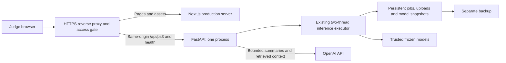

# Submission, hosting and database plan

**Status: proposed — 19 September 2026.** This document is a plan, not a deployment report. No cloud resource, public repository, domain, database or submission has been created by this work. Example URLs below are placeholders. The project owner chooses the account, domain and budget before provisioning.

## Recommendation

**Oracle option selected for preparation:** the user subsequently chose Oracle Cloud Always Free. The [Oracle deployment guide](ORACLE_DEPLOYMENT.md) and `deploy/oracle/` configuration implement preparation for the same single-server architecture. No cloud server has been created yet. The DigitalOcean discussion below is retained as the earlier alternative; it is not a purchase or deployment instruction.

Host the existing app on **one Linux virtual machine**, with a DigitalOcean Droplet as the concrete provider option. Run the production Next.js frontend and one FastAPI process behind an HTTPS reverse proxy. Keep the current saved-job files on persistent storage for the hackathon. A database migration is unnecessary for the initial judges' deployment.

Use a gated judging workspace containing approved example recordings and completed runs. Judges can upload, analyse, investigate and export there. Provide access instructions with the submission and test that judges can enter without an account-registration process. A shared gate protects this one workspace; it does **not** provide private accounts or separation between judges.

This is the smallest change from the working application. It preserves large uploads and long inference jobs, avoids rebuilding the models during requests, and keeps results across restarts. The trade-off is responsibility for server updates, backups, capacity and deployment windows. It is a single-server prototype, not a highly available production fleet platform.

## What the application actually needs

| Current implementation | Hosting implication |
| --- | --- |
| Next.js/React/Three.js frontend; Python/FastAPI ML backend | Run both Node and Python. A static website alone cannot serve this application. |
| `/api/ps3/jobs` accepts up to **64 MiB per file**, **1,500 MiB per batch**, and 100 files; Door accepts one stream per job | Every upload layer must support the intended size. The backend also bounds the multipart request before unlimited spooling. |
| Two inference threads and a maximum of eight pending jobs per service instance | Begin with one backend process. More Uvicorn workers multiply these limits; they do not create a shared durable queue. |
| Upload completes before a job ID is returned; inference then runs in the executor while the browser polls | Separate slow upload handling from long ML execution. Extending an HTTP timeout is not a job queue. |
| `data/runtime/ps3_jobs/<job>/job.json`, uploaded `inputs/`, and `model_snapshot/` | Persist the whole job directory. A saved report includes prediction rows, evidence, input hash, validation and model provenance. |
| Frozen `model.joblib` and `metadata.json` under each `data/ps3_artifacts/<subsystem>/` | Provision trusted, checksum-verified artifacts before starting. Normal uploads perform inference; they do not train. |
| Official examples read from `data/ps3/PS3/02_Datasets` | Install approved examples separately from Git. Preserve the expected directory structure and source filenames. |
| Abandoned queued/running jobs become failed after the owning process exits | Completed results persist, but interrupted jobs do not automatically resume. Drain work before deployment; let users retry interrupted jobs. |
| Global run library and project-wide investigation; no per-user ownership checks | The existing workspace is shared. Do not present anonymous uploads as private or expose personal local history. |
| Separate legacy `data/runtime/work_orders.sqlite3` | This is the earlier work-order store, **not** the current PS3 prediction database. |

Sources: [PS3 service](../backend/ps3/service.py), [PS3 routes](../backend/ps3/api.py), [upload limits](../backend/ps3/limits.py), [Next.js proxy configuration](../frontend/next.config.ts), [legacy orders](../backend/orders.py).

## Initial hosted architecture

1. **Provision a provisional CPU server**, initially considering 4 vCPU, 8 GB RAM and 80 GB disk. This is a sizing proposal, not measured capacity. Benchmark the largest ACV workbook, a Rail batch and two simultaneous jobs before confirming it. Select a region near the judges from the provider's available locations. No GPU is needed by the current inference code. [Droplet documentation](https://docs.digitalocean.com/products/droplets/), [region availability](https://docs.digitalocean.com/products/droplets/details/availability/).
2. **Build a pinned release** using `requirements-lock.txt` and `frontend/package-lock.json`. Use the project's supported Python/Node versions and test the Linux build; the current PowerShell launch scripts are local Windows tooling. Plan Linux service definitions for automatic startup/restart, separate logs and a non-root service account.
3. **Serve one HTTPS origin.** Route pages to Next.js on loopback port 3000 and required API routes directly to FastAPI on loopback port 8000. This bypasses an extra Next.js upload proxy hop and avoids cross-origin browser configuration. Do not expose the old prototype's unrelated mutation endpoints. Next.js itself recommends a reverse proxy when self-hosting. [Next.js self-hosting](https://nextjs.org/docs/app/guides/self-hosting).
4. **Configure the upload path deliberately.** Keep the backend's existing limits; allow multipart overhead at the reverse proxy, use appropriate upload idle timeouts and stream requests to the API where supported. Give `/api/ps3/investigate` enough response time for its current 75-second project investigation budget. Test end-to-end; the current 90-second Next.js proxy timeout is not proof that slow hosted uploads will succeed. Nginx's body limit and request buffering are explicit configuration choices. [Body size](https://nginx.org/en/docs/http/ngx_http_core_module.html#client_max_body_size), [request buffering](https://nginx.org/en/docs/http/ngx_http_proxy_module.html#proxy_request_buffering).
5. **Separate persistent data from code releases.** Plan a stable data directory, mounted or linked at the existing application paths. The service accepts explicit paths in Python, but there are no general deployment environment variables for these paths today. Configure the app factory or deployment layout explicitly; merely setting an invented variable will not relocate storage. Keep credentials outside source and models read-only to the runtime account where practical.
6. **Point an owned domain/subdomain at the server and enable a renewable TLS certificate.** Proposed URL: `https://railguard.example.com` — a documentation placeholder, not a live site or a domain owned by this project. Domain registration and DNS configuration remain to be done. [DNS setup](https://docs.digitalocean.com/products/networking/dns/getting-started/quickstart/).
7. **Back up and test restoration.** Back up frozen artifacts, selected job directories and configuration separately from the running server; keep secrets out of exported backups intended for sharing. Restore a completed job on staging and compare its export and model/input hashes. Provider disk backups support recovery, but a documented restore check is still required. [DigitalOcean backups](https://docs.digitalocean.com/products/backups/).

Upload bytes can temporarily occupy multipart spool space as well as retained input space. Eight accepted maximum batches alone can retain about 12 GiB, before historical jobs, temporary uploads, artifacts and backups. The queue limit does not cap uploads that are still arriving. Add ingress concurrency and disk-space admission limits before opening uploads to untrusted traffic; reserve space and schedule retention explicitly. Do not publish a larger capacity than the hosted tests demonstrate.

## Hosting alternatives

| Option | Fit and trade-off |
| --- | --- |
| **One VM — recommended for the first submission** | Fits the current filesystem and executor model; gives control over large requests and timeouts. Requires OS, proxy and backup administration. |
| **Paid Render frontend and backend, with a backend persistent disk** | More managed deployment and a provider URL. The backend needs persistent disk provisioning and artifact installation at runtime; the disk is unavailable during builds, is attached to one service instance, prevents horizontal scaling of that service and changes deploy behavior. Verify the full upload path before choosing it. [Render disks](https://render.com/docs/disks). |
| **Vercel frontend plus a separately hosted API** | Viable after routing large uploads directly to a persistent backend or object storage. Vercel Functions have a 4.5 MB request/response payload limit, so putting this upload endpoint in a Function is incompatible with its current limits. This fact alone does not establish every external-rewrite limit. [Vercel limits](https://vercel.com/docs/functions/limitations). |
| **Free ephemeral backend** | Poor fit for retained uploads and reliable judging access. For example, Render Free services sleep when idle and cannot attach a persistent disk. [Render Free limits](https://render.com/docs/free). |

No prices are quoted or purchases assumed. Confirm compute, disk, backup, domain, bandwidth and AI charges in the chosen account before provisioning.

## Database versus file storage

**For the hackathon:** retain the existing atomic JSON job records and files. They already support the shared saved-run library. Adding PostgreSQL immediately would add migration work without improving prediction quality or satisfying a missing CSV requirement.

**For a later multi-user release:** move searchable metadata into a database and keep large bytes in private object storage. A SQLite metadata database is a reasonable intermediate option on one server; managed PostgreSQL is the proposed destination when multiple users, API instances or workers need a common store. Neither a database nor object storage automatically supplies authentication or a task queue.

| Data | Proposed later destination |
| --- | --- |
| Users, project memberships and permissions | Metadata database |
| Jobs: owner/project, subsystem, state, timestamps, model version and progress | Metadata database |
| Files: source name, checksum, size, retention date and object key | Metadata database |
| Small prediction summaries and indexed report fields | Metadata database; larger complete reports may be objects referenced by key |
| Original CSV/XLSX files, report snapshots, downloadable ZIPs and immutable model bundles | Private object storage |
| AI request counts, token/cost records, quota reservations and audit events | Metadata database |
| Active inference tasks and retry/lease state | Durable queue or database-backed worker protocol, implemented explicitly |

DigitalOcean Spaces is an S3-compatible option for the file layer; managed PostgreSQL is available for relational metadata. Keep buckets private and give authorised clients short-lived access to specific objects. [Spaces](https://docs.digitalocean.com/products/spaces/), [controlled file sharing](https://docs.digitalocean.com/products/spaces/how-to/set-file-permissions/), [managed databases](https://docs.digitalocean.com/products/databases/).

Migration would preserve job IDs, exact filenames, model/input hashes, prediction schemas and original validation. First import existing jobs through a storage interface and verify export parity. Then add ownership checks to every list/read/export/investigation route, and replace the in-process executor with durable worker claims and retries. Only then add direct multipart object uploads, verify the completed object's size/checksum/schema, and enqueue inference. Existing Python loaders need local paths, so workers would stage authorised objects into bounded temporary storage. These are planned changes, not current capabilities.

## Public-demo access and AI spending

For judging, start with a clean shared workspace and only approved data. Keep the full app behind an HTTPS access gate; give judges its credentials through the submission channel. Apply the gate to APIs as well as pages and keep backend ports private. Network firewall rules should expose only the required web and administrative access. [Cloud firewall documentation](https://docs.digitalocean.com/products/networking/firewalls/).

If the submission requires unrestricted public viewing, expose a curated read-only demonstration first and keep upload/AI actions gated. A true anonymous or multi-user upload service needs the ownership and quota work above. Do not copy this computer's entire runtime library to a public host. Project-scope AI can inspect retained runs, which makes this distinction relevant to the actual implementation.

Use a dedicated server-side OpenAI project/key. Preserve current context bounds, local fallbacks and caches. Current AI semaphores limit concurrent work; they do **not** enforce per-user or daily spending. Before public AI access, add application-enforced quotas covering both `/investigate` and automatically requested `/summary`, plus provider billing alerts and a disable switch. Initial proposed controls are 10 investigations and 30 new summaries per identity per hour, with a configurable shared daily request/token ceiling. Confirm those values against the judging plan; they are not existing settings or a guaranteed currency cap. Predictions and exports should keep working when AI is unavailable or a quota is reached.

## Repository and submission preparation

The newer submission checklist supplied with this request adds a GitHub URL/README, a hosted prototype/domain, a 2–3 minute video and a short write-up. Complete those alongside the pinned PS3 app and CSV requirements. The pinned specification calls the write-up optional; including it satisfies the newer checklist without changing the scoring formulas. [Pinned PS3 deliverables](https://github.com/aochinwen/NebulaX-Hackathon-ProblemStatement/blob/16526c02579c7f37e54eaaa42a4cc6d4ceb19994/PS3/01_Problem_Statement_3_Specifications.md).

- [ ] Prepare a GitHub repository and README with setup, architecture, supported inputs, model provenance, measured validation limits, live-demo access and export instructions. Proposed URL: `https://github.com/OWNER/REPOSITORY` — placeholder only. Review the actual staged files and Git history before publication.
- [ ] Exclude credentials and all environment variants, raw organiser/uploaded datasets, runtime jobs, logs, caches, backups, local database files, `.venv`, `node_modules` and `.next`. The publication `.gitignore` now covers environment variants and private session outputs while permitting secret-free `.env.example` files and the four active model/provenance pairs. Review staged files; ignoring a file does not remove it from Git history.
- [ ] Keep source, dependency locks, tests, documentation, a secret-free configuration example and reproducibility scripts. Include only reviewed, relevant results/screenshots. Distribute trusted frozen model bundles separately if needed, with hashes and setup instructions; do not publish training feature caches or accept user-uploaded pickle/joblib artifacts.
- [ ] Publish and test the hosted prototype from a fresh external browser, with the laptop's localhost services unavailable. Verify all four subsystems, batch upload, reload/persisted history, charts, 3D, local/AI summaries, selectable exports and download filenames. Check restart recovery, HTTPS, access controls, disk limits and AI fallback. These checks are planned, not reported as passed.
- [ ] Run the distributed held-out Test inputs through the app and export **one `predictions.zip`**, containing only `door_predictions.csv`, `acv_predictions.csv`, `rail_predictions.csv` and `shm_predictions.csv` at its root. Check complete file coverage, exact schemas and no duplicate IDs. Door uses segment timestamps; ACV preserves two-digit header IDs and pipe-separated rankings. Do not substitute illustrative example outputs or call hidden-Test predictions measured accuracy.
- [ ] Record a **2–3 minute** end-to-end video: choose system → upload/drag file → read result → inspect evidence/3D → download; briefly show all four task outputs and the model-performance context. Demonstrate the real app and results. Avoid showing credentials, private files or unsupported maintenance claims.
- [ ] Write a short explanation of task coverage, feature engineering, candidate selection, grouped/held-out validation, limitations and practical use. Distinguish retrospective development results from hidden-Test performance; explain the AI layer's supporting role and the illustrative 3D geometry.
- [ ] Package under the **exact registered team name**, including the app/deployment instructions, video, separate `predictions.zip`, GitHub/live links and write-up. Preserve the official folder conventions where applicable; omit raw datasets. Replace every placeholder and verify permissions and links before final submission.

## Implementation order after this plan

1. Confirm the repository visibility, hosting account, domain, budget and judging access mode.
2. Prepare a clean release and trusted artifact/example package; add deployment configuration and the agreed access/quota controls.
3. Provision the persistent server, build, deploy and run the hosted acceptance checks.
4. Generate and inspect final predictions, record the video, complete the write-up and assemble the submission.

Database migration and public multi-user operation follow the hackathon deployment unless those capabilities become a separate requirement. This plan changes no model, validation result, inference behavior or existing local service.
